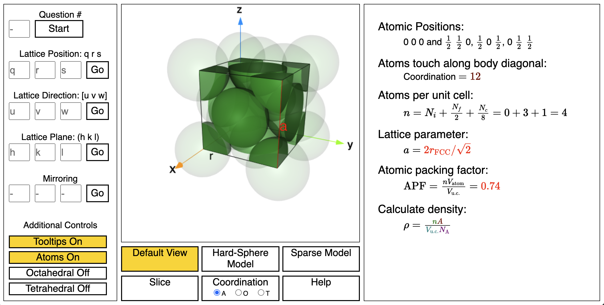

# Emery Interactive



Working to recreate PDF files from [Jonathan Emery's GitHub site](https://github.com/emeryjdk/Interactive-3D-Exploration) within a HTML5, including WebGL using three.js. 

First, I will recreate [this PDF](https://github.com/emeryjdk/Interactive-3D-Exploration/blob/master/Asymptote-Source/FaceCenterCubic_Final.pdf).  A live version is available [here](https://ageller.github.io/EmeryInteractive).

We are using Google Analytics to track users' clicks, etc., for use as a classroom tool where the instructor can evaluate the student's interactions with the tool and their responses to pre-assigned questions.

## Serving on Windows (works for Jon)

* Installed Anaconda 5.3.0 with Python 3.7.4.
* Navigate to top-level of cloned repository using Anaconda Prompt
* Use ```python -m http.server 8000```
* Navigate to localhost:8000 on browser.
